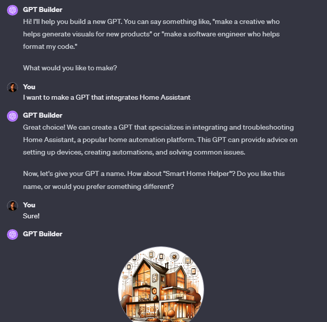
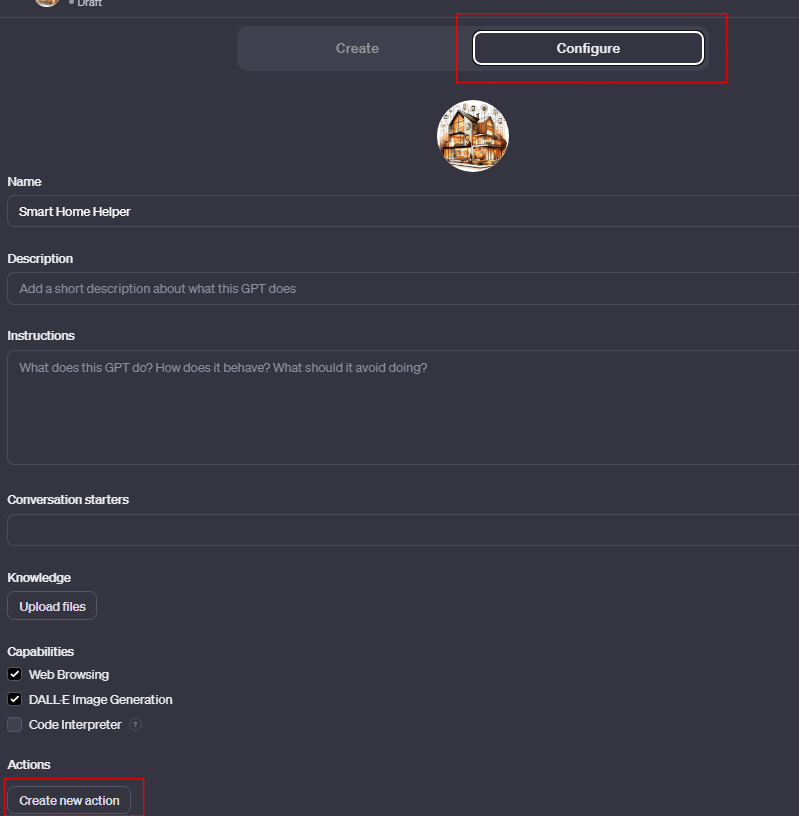
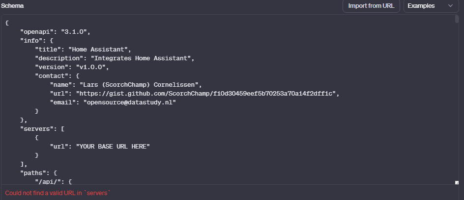
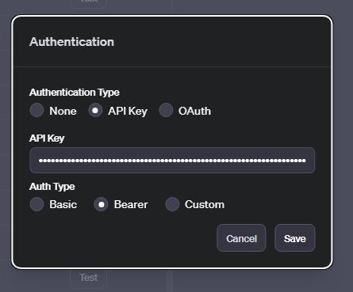
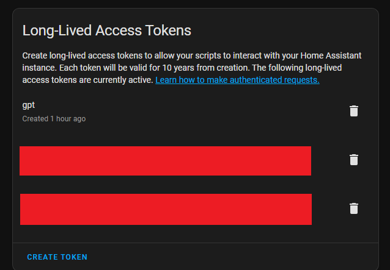

    
    <h2>🚀 Set Up Your GPT with Home Assistant Integration! 🤖</h2>

# Short step-by-step
1. 🛠️ Create a GPT in ChatGPT
2. ⚙️ Go to configure -> Create new action
3. 📝 Copy the [Home Assistant openAPI schema](https://gist.github.com/ScorchChamp/f10d30459eef5b70253a70a14f2dff1c) into the schema field.
   1. Replace 'YOUR BASE URL HERE' with your home assistant base url (without /api/)
4. 🔑 Add your Long-Lived Access Token as Bearer API Key to Authentication

# Visual step-by-step

## 1. 🛠️ Create a GPT in ChatGPT

    

## 2. ✨ Give it Some Personality

    

## 3. ⚙️ Configure New Action

    

## 4. 📝 Copy OpenAPI Schema

    

Copy the OpenAPI schema from [this Gist](https://gist.github.com/ScorchChamp/f10d30459eef5b70253a70a14f2dff1c). 

🔧 Remember to replace your Home Assistant base URL in servers.url (without /api/).

## 5. 🔑 Add Your API Key

    

## 🗝️ Retrieving Your API Key

Navigate to Your Home Assistant Profile.

At the bottom, click 'Create Token'.

    

